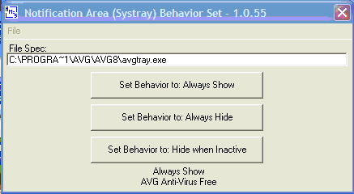



## Notification Area \(Systray\) Set

### Description

The "Notification Area" (Systray) is another one of Microsoft's "Manhattan Projects" (Best Kept Secrets). Days of searching Google I only found out that the info was in a registry value. I wanted to set the "Behavior" to "Always Show" for my "Send to Tray" applications where the icon in the tray indicated something. Windows Systray NOTIFYICONDATA should have something to do this with, if it does I can't find any info on how to do it?

This project is actually three projects in one:

1. The Discovery process, where in the registry and what bytes to change to set "Always Show", "Always Hide" or "Hide when Inactive". Possibly more info on the subject than anyone wants to know!

2. A clubby program to list all Systray applications and make changes to "Behavior". In NotifyArea.zip package.

3. A self contained module to add to a "Send to Tray" project that will set "Always Show" when the application is started. Call "BehaviorGet" to test if "Always Show" is set, if it isn't call "BehaviorSet" with the file spec to the application and it returns true if successful.
 
### More Info
 

             |
---                |---
**Submitted On**   |2009-02-06 22:19:22
**By**             |[Howard L\. McHenery](https://github.com/Planet-Source-Code/PSCIndex/blob/master/ByAuthor/howard-l-mchenery.md)
**Level**          |Advanced
**User Rating**    |5.0 (15 globes from 3 users)
**Compatibility**  |VB 6\.0
**Category**       |[Windows System Services](https://github.com/Planet-Source-Code/PSCIndex/blob/master/ByCategory/windows-system-services__1-35.md)
**World**          |[Visual Basic](https://github.com/Planet-Source-Code/PSCIndex/blob/master/ByWorld/visual-basic.md)
**Archive File**   |[Notificati214300262009\.zip](https://github.com/Planet-Source-Code/howard-l-mchenery-notification-area-systray-set__1-71731/archive/master.zip)

